# Study Design Simplifier

Flutter desktop app that turns VCE study design documents into a
searchable, plain-language browser: pick a subject, filter by
outcome/key knowledge/key skill/command term, see official wording next
to a plain-language rewrite.

Two parts, connected only by a generated JSON file — the backend never
runs at app runtime:

- **`backend/`** — offline Python pipeline. Converts source
  `.docx`/`.pdf` study design files into `study_items.json`. Run
  manually. See [backend/README.md](backend/README.md).
- **`lib/`** — Flutter app. Reads the bundled `study_items.json` at
  startup.

## Architecture

```mermaid
flowchart LR
    subgraph Backend["backend/  (offline, run manually)"]
        direction TB
        A["source_docs/\n*.docx / *.pdf"] --> B["parse_docx.py\nparse_pdf.py"]
        B -->|"RawBlock list\n(text + heading level)"| C["extract_items.py"]
        C -->|"StudyItem list\n(Outcome / Key Knowledge /\nKey Skill / Command Term)"| D["simplify.py"]
        D -->|"+ plain_language_text\n(TF-IDF + jargon sub +\nspaCy clause split)"| E["acronyms.py"]
        E -->|"+ expanded acronyms"| F["build.py"]
    end

    F --> G[("output/\nstudy_items.json")]
    G -->|"cp (manual step)"| H[("assets/data/\nstudy_items.json")]

    subgraph App["lib/  (Flutter app)"]
        direction TB
        H --> I["StudyDataRepository\n+ PreferencesRepository"]
        I --> J["HomeScreen\n(filter/search state)"]
        J --> K["Sidebar · ResultsList\nDetailPanel"]
    end
```



No LLM, no API calls anywhere in the backend — scikit-learn
(TF-IDF/cosine similarity) and spaCy (`en_core_web_sm`, a small
statistical parser) only. Full explanation of each stage, known
limitations, and fixed bugs is in [backend/README.md](backend/README.md).

To refresh the dataset after adding/updating source files:

```bash
cd backend && source .venv/bin/activate && python -m ingest.build
cd .. && cp backend/output/study_items.json assets/data/study_items.json
```

## Features

- **Subject sidebar** — derived from whatever subjects are in the
  bundled dataset, not hardcoded.
- **Search** — full-text, across title/official text/plain-language
  text, debounced 200ms.
- **Category filter** — segmented control: Outcome / Key Knowledge /
  Key Skill / Command Term.
- **Grouped results list** — Unit → Area of Study headers, natural
  reading order; category-colored accent per card; `ListView.builder`
  so only visible cards get built.
- **Detail panel** — official text + plain-language rewrite side by
  side; shows a note instead of a duplicate when there's nothing to
  simplify; toggle to mark an item complete.
- **Completion tracking** — toolbar chip, persisted via
  `SharedPreferences`.
- **Light/dark theme** — persisted via `SharedPreferences`.

## Project structure

```
lib/
├── main.dart                        # App entry point, theme wiring
├── models/
│   └── study_item.dart              # StudyItem data model + fromJson
├── data/
│   ├── study_data_repository.dart   # Loads assets/data/study_items.json
│   └── preferences_repository.dart  # Persists completion status + dark mode
├── theme/
│   ├── app_colors.dart              # Light/dark color tokens
│   ├── category_colors.dart         # Per-category accent colors
│   └── theme_model.dart             # ChangeNotifier for theme state
├── screens/
│   └── home_screen.dart             # Three-pane layout + filtering logic
└── widgets/
    ├── sidebar.dart                  # Subject list
    ├── search_bar_widget.dart
    ├── category_tabs.dart            # Segmented-control category filter
    ├── results_list.dart             # Grouped, filtered result cards (ListView.builder)
    ├── detail_panel.dart             # Selected item detail view
    ├── settings_slideout.dart        # Theme toggle panel
    └── loading_screen.dart           # Startup loading state
assets/data/
└── study_items.json                 # Generated dataset (copied from backend/output/)
backend/
├── ingest/
│   ├── models.py                    # RawBlock / StudyItem dataclasses
│   ├── heading_patterns.py          # VCAA heading regexes, glossary-table filtering
│   ├── parse_docx.py                # .docx -> RawBlock list
│   ├── parse_pdf.py                 # .pdf -> RawBlock list
│   ├── extract_items.py             # RawBlock list -> StudyItem list
│   ├── simplify.py                  # official_text -> plain_language_text
│   ├── jargon_dictionary.json       # word/phrase -> plain-language map
│   ├── acronyms.py                  # cross-item acronym expansion
│   └── build.py                     # CLI entry point
├── scripts/
│   └── analyze_vocabulary.py        # jargon dictionary authoring aid
├── source_docs/                     # .docx/.pdf study design files (gitignored)
└── output/study_items.json          # Pipeline output
```

## Language notes

Dart has no `public`/`private`/`protected` keywords. Its access
modifier is a naming convention: a leading underscore (`_isDark`,
`_HomeScreenState`, `_applyFilters`) makes a member private to its own
library (file); everything else is public by default. Used
consistently throughout `lib/` — see
[theme_model.dart](lib/theme/theme_model.dart) for a concrete example
(private `_isDark` field, exposed only via a read-only `isDark` getter
and a `toggleTheme()` method).

## Current state

- Dataset: 2,267 items across 12 subjects (Applied Computing, Business
  Management, Data Analytics, English EAL, Foundation Mathematics,
  General Mathematics, Mathematical Methods, Media, Philosophy,
  Physics, Software Development, Specialist Mathematics), generated
  from 7 real VCAA study design files.
- Completion status + dark-mode preference persist via
  `PreferencesRepository`; everything else is in-memory `setState`,
  re-read fresh from the bundled asset every launch.
- Fixed three-column desktop layout (220px sidebar, 35%-width detail
  panel); not adapted for phone-sized screens.
- Plain-language rewrites are rule-based (extractive + substitution +
  clause-splitting), not true paraphrasing — see
  [backend/README.md](backend/README.md) for known limitations.

## Getting started

Requires the [Flutter SDK](https://docs.flutter.dev/get-started/install)
(Dart SDK `^3.7.2`, per `pubspec.yaml`).

```bash
flutter pub get
flutter run
```

Platform scaffolding for Android/iOS/web/macOS/Linux/Windows is
included. `flutter devices` to list targets, `flutter run -d macos` /
`-d chrome` / etc. to target one.

### Tests

```bash
flutter test
```
